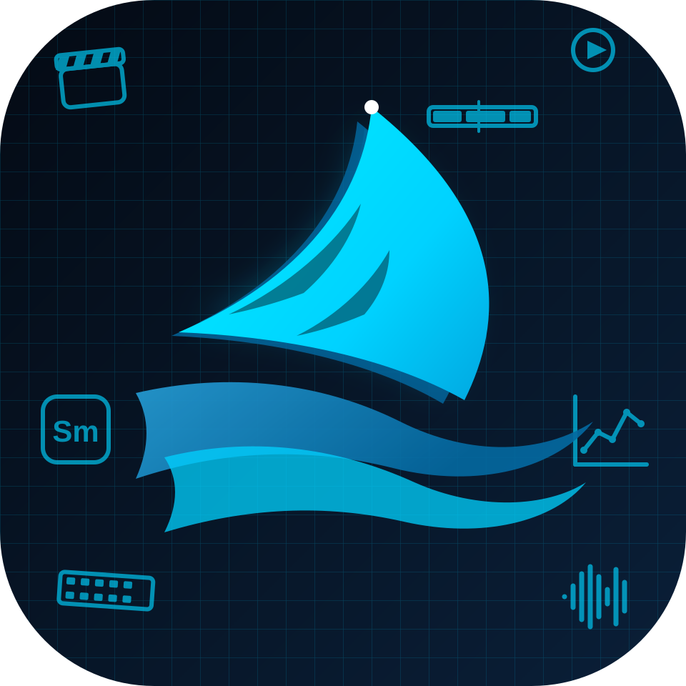

<div align="center">



# Alight Motion Web — SharkMotion

**Studio Motion Design & Video Editor "Jedag-Jedug" Berbasis Web Modern, Cepat, dan Gratis.**

[](https://github.com/MhmmdFaizal04/SharkMotion)
[](https://github.com/MhmmdFaizal04/SharkMotion)
[](https://github.com/MhmmdFaizal04/SharkMotion)
[-0284c7?style=for-the-badge&logo=webassembly&logoColor=white)](https://github.com/MhmmdFaizal04/SharkMotion)
[](https://vercel.com)
[](LICENSE)

<br/>

[🚀 Coba SharkMotion](#-cara-menjalankan-secara-lokal) • [✨ Fitur Utama](#-fitur-utama) • [⚡ Tutorial Jedag-Jedug](#-panduan-spesial-cara-membuat-video-jedag-jedug-jj-di-sharkmotion) • [⌨️ Shortcut](#%EF%B8%8F-daftar-shortcut-keyboard) • [🌐 Deploy ke Vercel](#-deploy-ke-vercel)

</div>

---

## 📖 Tentang SharkMotion

**SharkMotion** adalah aplikasi motion graphics dan video editing web canggih yang dirancang sebagai alternatif **Alight Motion versi Web**. SharkMotion memungkinkan kreator konten, motion graphic artist, dan editor AM/TikTok untuk membuat animasi kurva halus, efek transisi dinamis, serta video **Jedag-Jedug (JJ)** langsung dari browser desktop tanpa perlu mengunduh emulator Android atau software berat.

Semua proses editing dan rendering berlangsung 100% secara lokal di browser Anda (*Client-Side Rendering* dengan Canvas 2D + Web Audio API + FFmpeg.wasm), menjamin privasi video tetap aman di perangkat Anda.

---

## ✨ Fitur Utama

- ⏱️ **Multi-Track Timeline Presisi Tinggi**: Mendukung pengelolaan layer tak terbatas (Video, Audio, Teks, Shape, Gambar, dan Adjustment).
- 📈 **Sistem Keyframe & Bezier Graph Editor**: Pengaturan interpolasi animasi lengkap (*Linear*, *Ease In*, *Ease Out*, *Custom S-Curve*, *Bounce / Back*).
- 🦈 **SharkTools Suite**:
  - **Anchor Point Grid**: Pindahkan titik poros layer secara instan ke 9 posisi grid atau pusat komposisi.
  - **Quick Cut & Split**: Potong layer di awal (`CUT_FRONT`), bagi dua tepat di playhead (`CUT_MID`), atau potong akhir (`CUT_BACK`).
  - **Smart Align**: Meratakan layer secara horizontal, vertikal, tengah, atas, bawah hanya dengan 1 klik.
  - **Pre-compose**: Gabungkan beberapa layer menjadi satu grup comp baru.
- 🎨 **Koleksi Efek Dinamis (AM-Style)**:
  - **RGB Split / Chromatic Aberration**
  - **Directional Blur & Lens Blur**
  - **Glow & Neon Light FX**
  - **Camera Shake (S_Shake replacement)**
  - **Wave Warp & Motion Tiles**
  - **Color Grading & Vignette**
- 🎵 **Audio Waveform & Visualizer**: Visualisasi bentuk gelombang audio interaktif dengan penanda beat (*Beat Markers*) untuk sinkronisasi musik yang presisi.
- 🎬 **Multi-Format Export**: Render langsung ke format video **MP4 (H.264 via FFmpeg.wasm)**, PNG Frame Snapshot, dan Image Sequence (.ZIP).
- 💾 **Local-First Autosave**: Proyek tersimpan secara otomatis di memori lokal (*IndexedDB & LocalStorage*) tanpa takut kehilangan pekerjaan saat browser tertutup.
- 🌙 **Modern Cyber-Dark Theme**: Antarmuka bertema gelap neon cyan terinspirasi dari estetika studio profesional Alight Motion.

---

## 🛠️ Cara Menjalankan Secara Lokal

SharkMotion adalah proyek web *zero-dependency* murni (HTML5, CSS3, Vanilla ES6+). Anda dapat langsung menjalankannya:

### Opsi 1: Menggunakan Live Server / Local Web Server (Direkomendasikan)
Untuk performa optimal rendering FFmpeg WASM dan Web Worker:

```bash
# Clone repository
git clone https://github.com/MhmmdFaizal04/SharkMotion.git

# Masuk ke folder proyek
cd SharkMotion

# Jalankan server lokal sederhana (pilih salah satu):
# Menggunakan Node.js npx serve:
npx serve .

# Atau menggunakan Python 3:
python -m http.server 3000
```
Buka browser dan akses `http://localhost:3000`.

### Opsi 2: Buka Langsung File HTML
Buka file `index.html` (Landing Page) atau `editor.html` (Studio Editor) langsung di browser pilihan Anda (Google Chrome, Microsoft Edge, Brave, dsb).

---

## 🚀 Cara Menggunakan SharkMotion

### 1. Membuat Proyek Baru
1. Buka `index.html` atau langsung masuk ke `editor.html`.
2. Klik tombol **+ Proyek Baru** pada panel atas atau dialog selamat datang.
3. Tentukan pengaturan kanvas:
   - **Aspek Rasio**: `9:16` (TikTok / Reels / Shorts), `16:9` (YouTube / Landscape), atau `1:1` (Instagram Feed).
   - **Resolusi**: `720p`, `1080p Full HD`, atau `4K Ultra HD`.
   - **Frame Rate**: `30 FPS` atau `60 FPS` (sangat disarankan 60 FPS untuk video beat halus).

### 2. Memasukkan Media & Mengatur Timeline
1. Klik tombol **+ Tambah Media** untuk mengunggah file video, lagu audio (MP3/WAV), atau gambar PNG/JPG.
2. Seret (*drag*) layer pada timeline untuk mengatur urutan susunan, durasi, dan waktu mulai (*in-point*).
3. Pilih layer yang ingin diedit untuk membuka panel properti (Posisi, Skala, Rotasi, Opacity, dan Efek).

### 3. Mengatur Animasi Keyframe
1. Gerakkan playhead ke titik waktu awal animasi.
2. Klik ikon **Belah Ketupat (Keyframe)** di sebelah properti (misalnya *Skala* atau *Posisi*).
3. Geser playhead ke titik waktu tujuan, lalu ubah nilai propertinya (keyframe baru akan dibuat otomatis).
4. Klik tombol **Grafik (Curve Editor)** di sebelah keyframe untuk mengatur kurva kecepatan animasi agar luwes dan dinamis.

---

## ⚡ Panduan Spesial: Cara Membuat Video Jedag-Jedug (JJ) di SharkMotion

Berikut adalah panduan langkah demi langkah membuat video beat **Jedag-Jedug (JJ)** khas Alight Motion di SharkMotion:

```
[Import Musik DJ] ➔ [Tandai Beat/Waveform] ➔ [Split Klip per Beat] ➔ [Animasi Zoom Keyframe] ➔ [Beri Efek Shake & Flash] ➔ [Export 60 FPS]
```

### Langkah 1: Siapkan Lagu & Buat Beat Markers
1. Masukkan file lagu DJ TikTok / Phonk / Remix ke timeline melalui tombol **Audio**.
2. Putar lagu dengan menekan tombol **Spasi**.
3. Dengarkan ketukan *kick* bass / snare drum lagu.
4. Tekan tombol **M** pada keyboard setiap kali mendengar dentuman beat untuk membuat **Beat Marker** (garis penanda warna di timeline).

### Langkah 2: Potong Layer Video / Foto Sesuai Beat
1. Pasang klip video atau foto yang ingin dijadikan objek jedag-jedug di atas track audio.
2. Tempatkan playhead tepat di garis marker beat pertama.
3. Tekan shortcut **S** atau buka panel **SharkTools** di bagian bawah dan klik tombol **`[ ]` (CUT_MID)**.
4. Ulangi pemotongan pada setiap marker beat berikutnya sehingga klip Anda terbagi menjadi potongan-potongan kecil sesuai ritme musik.

### Langkah 3: Berikan Animasi Zoom Hentakan (Scale Keyframe)
Pada setiap potongan klip di awal hentakan beat:
1. Di frame ke-0 potongan klip, buat keyframe **Skala = 125%** (posisi zoom in).
2. Di frame ke-5 atau ke-8 potongan klip, buat keyframe **Skala = 100%** (kembali ke ukuran normal).
3. Buka **Graph Editor (Kurva)** di antara kedua keyframe:
   - Tarik handle kurva ke arah bawah-kanan membentuk kurva **Fast In - Slow Out** (kecepatan awal tinggi lalu melambat halus). Ini memberikan efek hentakan "menghentak" yang tajam dan responsif.

### Langkah 4: Tambahkan Efek Flash Putih (White Blink)
Flash putih adalah ciri khas video Jedag-Jedug saat bass menggelegar:
1. Klik **+ Tambah Layer** ➔ Pilih **Shape (Kotak)**.
2. Perbesar ukuran shape hingga menutupi seluruh layar kanvas dan beri warna putih `#FFFFFF`.
3. Potong durasi kotak putih sangat singkat (hanya 3 hingga 5 frame saja tepat di awal ketukan beat).
4. Buat keyframe pada properti **Opacity**:
   - Frame 1: `Opacity = 90%`
   - Frame 4: `Opacity = 0%`
5. Atur kurva menjadi *Ease-Out*. Saat diputar, layar akan memancarkan kilatan lampu putih yang mengikuti dentuman musik.

### Langkah 5: Pasang Efek Kamera Shake & RGB Split
1. Pilih klip potongan beat, buka panel **Efek** ➔ Tambahkan efek **Shake / S_Shake Replacement**.
   - Atur *Frequency*: `8.0` - `12.0`
   - Atur *Magnitude / Strength*: Mulai dari `20px` di awal beat dan keyframe turun ke `0px`.
2. Tambahkan efek **RGB Split / Chromatic Aberration**:
   - Berikan nilai pergeseran warna merah-biru (*Distance*) sekitar `6px - 10px` di awal beat, lalu turun ke `0px` dalam 4 frame.
   - Efek ini menghasilkan getaran visual glitch neon khas anime/JJ AM.

### Langkah 6: Preview & Export 60 FPS
1. Tekan tombol **Spasi** untuk memutar preview secara real-time.
2. Klik tombol **Export Video** di pojok kanan atas kanvas.
3. Pilih opsi **MP4 Video (60 FPS)** dan resolusi **1080p (Full HD)**.
4. Tunggu progress encoding FFmpeg hingga 100%, lalu simpan video hasil karya Jedag-Jedug Anda ke perangkat!

---

## ⌨️ Daftar Shortcut Keyboard

| Shortcut | Aksi |
|---|---|
| `Spasi` | Play / Pause Pemutaran Timeline |
| `S` atau `Ctrl + K` | Potong / Split Layer di Playhead (`CUT_MID`) |
| `M` | Tambah Beat Marker pada Titik Waktu Aktif |
| `J` | Lompat ke Keyframe / Marker Sebelumnya |
| `K` | Lompat ke Keyframe / Marker Berikutnya |
| `Delete` / `Backspace` | Hapus Layer yang Sedang Dipilih |
| `Ctrl + Z` | Undo (Batalkan Tindakan Terakhir) |
| `Ctrl + Y` / `Ctrl + Shift + Z` | Redo (Ulangi Tindakan) |
| `Ctrl + C` / `Ctrl + V` | Salin / Tempel Layer |
| `Ctrl + E` | Buka Dialog Export Video / Gambar |
| `F` | Zoom to Fit Tampilan Kanvas |

---

## 📁 Struktur Folder Repository

```
SharkMotion/
├── index.html                  # Halaman Utama / Landing Page
├── editor.html                 # Workspace Studio Video Editor Utama
├── version.json                # Data Versi & Build Metadata
├── vercel.json                 # Konfigurasi Deployment Vercel & Header COOP/COEP
├── CHANGELOG.md                # Riwayat Pembaruan & Fitur
├── assets/                     # Ikon, Favicon, dan Logo Resmi SharkMotion
│   ├── icon.svg                # Logo Squircle Shark Cyan
│   └── ...
├── css/                        # Stylesheet Aplikasi
│   ├── main.css                # Style Tampilan Landing Page
│   ├── editor.css              # Style Studio Editor
│   └── theme.css               # Definisi Tema Warna Cyber Neon
├── js/                         # Skrip Logika Frontend
│   ├── editor.js               # Engine Editor, Timeline, Render Loop & Export
│   ├── sharktools-adapter.js   # Adapter Bridge Runtime SharkTools
│   ├── audio-analyzer.js       # Web Audio API Waveform & Beat Analyzer
│   └── ...
├── effects/                    # Shaders & Logika Efek Video
│   ├── rgb-split.js            # Algoritma Chromatic Aberration
│   ├── blur.js                 # Directional & Lens Blur Filter
│   └── ...
├── Extension/                  # Suite SharkMotion Tools Standalone
│   ├── extension.html          # Panel Popover SharkTools
│   ├── assets/                 # Aset Logo SharkMotion
│   └── js/                     # CEP Polyfill & Modul SharkTools
└── vendor/                     # Pustaka Eksternal Offline
    └── ffmpeg/                 # FFmpeg.wasm Core & WebAssembly Engine
```

---

## 🌐 Deploy ke Vercel

SharkMotion sudah dilengkapi file konfigurasi `vercel.json` dengan header keamanan yang diperlukan untuk multi-threading WebAssembly (`Cross-Origin-Opener-Policy: same-origin` dan `Cross-Origin-Embedder-Policy: require-corp`).

### Deploy Lewat Vercel CLI:
```bash
npm i -g vercel
vercel
```

### Deploy Lewat GitHub:
1. Hubungkan repository ini ke dashboard akun [Vercel](https://vercel.com).
2. Pilih **Framework Preset**: `Other` (Root Directory: `./`).
3. Klik **Deploy** — website SharkMotion Anda akan langsung aktif secara global dalam hitungan detik!

---

## 🤝 Kontribusi

Kontribusi dari komunitas motion design, developer open-source, dan kreator editor video sangat disambut hangat!
1. Fork repository ini.
2. Buat branch fitur baru (`git checkout -b fitur/efek-baru`).
3. Commit perubahan Anda (`git commit -m 'Menambahkan efek transisi baru'`).
4. Push ke branch Anda (`git push origin fitur/efek-baru`).
5. Buat Pull Request.

---

## 📄 Lisensi

Didistribusikan di bawah lisensi **MIT License**. Lihat file `LICENSE` untuk informasi selengkapnya.

---

<div align="center">
  <b>Dibuat dengan ❤️ untuk Komunitas Kreator Motion Graphics & Editor Indonesia</b><br/>
  <sub>SharkMotion • Alight Motion Versi Web</sub>
</div>
